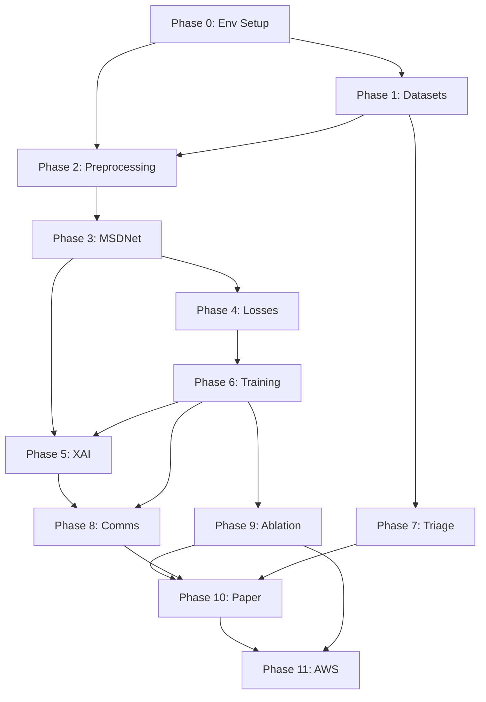

# IRDAS — Integrated Retinal Disease Analysis System
## Agent Execution Guide (Read this completely before executing any step)

---

## WHO YOU ARE AND WHAT YOU ARE DOING

You are an agentic AI executing a complete ML research project for a B.Tech Computer Science student (Shivendra) at Lovely Professional University. Your job is to build, train, evaluate, and document the IRDAS system — a three-stage retinal disease screening pipeline designed for low-resource clinical deployment in India.

This is a **research paper project**, not a production system. Every architectural decision has a justification that must appear in the paper. Every number you produce is a result that will be reported. Do not take shortcuts that would compromise reproducibility.

**Your execution environment:** Kaggle Notebooks (primary), with VS Code + Claude Code for local file editing. GPU: NVIDIA T4 (Kaggle free tier, 30h/week quota). Python 3.10+, PyTorch 2.1+.

**When to stop and ask Shivendra:**
- Any dataset requires a form/agreement to download (HRDC 2023)
- A training run exceeds 8 hours on T4 (something is wrong)
- Validation metrics are more than 15% below targets
- Any API key is needed (Gemini — Shivendra holds this)
- You encounter a license restriction

---

## 📊 MASTER PROGRESS DASHBOARD

> **Update this table after every work session. Commit changes to git.**

| Phase | Description | Est. Hours | Status | Started | Completed | Blockers |
|-------|------------|-----------|--------|---------|-----------|----------|
| 0 | Environment Setup | 2h | `[ ]` | — | — | — |
| 1 | Dataset Acquisition & Validation | 4h | `[ ]` | — | — | HRDC requires manual registration |
| 2 | Preprocessing Pipeline | 3h | `[ ]` | — | — | — |
| 3 | MSDNet Architecture | 5h | `[ ]` | — | — | — |
| 4 | Loss Functions | 2h | `[ ]` | — | — | — |
| 5 | XAI (Grad-CAM++) | 2h | `[ ]` | — | — | — |
| 6 | Training Loop + Baseline | 8h | `[ ]` | — | — | GPU quota |
| 7 | Stage 1 — Triage Model | 3h | `[ ]` | — | — | NHANES data merge |
| 8 | Stage 3 — Multilingual Comms | 2h | `[ ]` | — | — | Gemini API key |
| 9 | Evaluation & Ablation | 10h | `[ ]` | — | — | 6 training runs |
| 10 | Paper Writing | 15h | `[ ]` | — | — | — |
| 11 | AWS Deployment | 5h | `[ ]` | — | — | Student pack credits |
| **Total** | | **~61h** | | | | |

**Status legend:** `[ ]` Not started · `[/]` In progress · `[x]` Done · `[!]` Blocked

### Phase Dependency Graph



**Key insight:** Phases 7 (Triage/XGBoost) and Phases 3-6 (MSDNet) run **in parallel** — do Phase 7 while waiting for GPU quota to reset.

### Metric Targets Quick Reference

| Metric | Dataset | Target | STOP & Debug If |
|--------|---------|--------|------------------|
| DR QWK (baseline) | APTOS val | > 0.82 | < 0.70 after 30 epochs |
| DR QWK (MSDNet) | APTOS val | > 0.89 | < 0.80 after 30 epochs |
| HR AUC | HRDC val | > 0.91 | < 0.75 after 30 epochs |
| Vessel Dice | DRIVE test | > 0.76 | < 0.60 after 20 epochs |
| ECE | APTOS test | < 0.06 | > 0.15 |
| DR QWK (generalize) | IDRiD test | > 0.72 | < 0.55 |
| Triage AUC | NHANES 5-fold | > 0.79 | < 0.65 |

---

## SYSTEM OVERVIEW

IRDAS has three stages. The CV model (Stage 2) is the core research contribution for a Computer Vision subject and the primary novelty for journal publication.

```
Stage 1: Risk Triage        Stage 2: MSDNet (CV Core)      Stage 3: Communication
─────────────────────       ──────────────────────────      ──────────────────────
Input: clinical EHR         Input: fundus image             Input: model outputs
Model: XGBoost              Model: EfficientNet-B0 +        Model: Gemini API via
Output: patient             FPN + Disease CBAM +            LangChain
priority queue              Vessel decoder +                Output: plain-language
                            Contrastive loss +              patient report in
                            MC Dropout                      detected Indic language
                            Output: DR grade 0-4,
                            HR grade, uncertainty,
                            per-disease heatmaps
```

**The core novel contribution** is the inter-disease contrastive disentanglement loss — a training objective that prevents DR and HR features from entangling in the shared backbone when both diseases co-occur in a patient. No published retinal AI paper has this. Protect it.

---

## COMPLETE TECH STACK

```
Core ML:
  python==3.10
  torch==2.1.0
  torchvision==0.16.0
  timm==0.9.12              # EfficientNet-B0 pretrained weights
  segmentation-models-pytorch==0.3.3   # Vessel U-Net decoder
  albumentations==1.3.1     # Medical image augmentation
  opencv-python==4.8.1
  pytorch-grad-cam==1.4.8   # Grad-CAM++ per branch

Triage (Stage 1):
  xgboost==2.0.1
  shap==0.43.0
  scikit-learn==1.3.2
  pandas==2.1.1

Uncertainty:
  netcal==1.3.5             # Expected Calibration Error

Communication (Stage 3):
  langchain==0.1.0
  langchain-google-genai==0.0.6
  google-generativeai==0.3.2

Evaluation:
  numpy==1.24.0
  matplotlib==3.8.0
  seaborn==0.13.0
  scipy==1.11.3

Tracking:
  wandb==0.16.0             # Experiment tracking (free tier)
```

---

## 📝 LOGGING STRATEGY

### 1. Experiment Tracking — WandB

```python
# === STANDARD WANDB INIT — use at top of every training notebook ===
import wandb, json
from datetime import datetime

def init_experiment(experiment_name, config, notes=""):
    """Call this at the start of every training run."""
    run = wandb.init(
        project="IRDAS",
        name=f"{experiment_name}_{datetime.now().strftime('%Y%m%d_%H%M')}",
        config=config, notes=notes,
        tags=[experiment_name, "v1"], save_code=True
    )
    # Local JSON backup
    log_entry = {
        "experiment": experiment_name,
        "started_at": datetime.now().isoformat(),
        "config": config,
        "wandb_run_id": run.id,
        "status": "running"
    }
    with open(f"logs/{experiment_name}_init.json", "w") as f:
        json.dump(log_entry, f, indent=2)
    return run
```

### 2. Local Session Logs — Save Before Every Kaggle Session Ends

```python
def save_session_log(session_name, metrics, notes=""):
    """ALWAYS run this before Kaggle session ends."""
    import json, os
    from datetime import datetime
    log = {
        "session": session_name,
        "timestamp": datetime.now().isoformat(),
        "metrics": metrics,
        "notes": notes,
        "gpu_hours_used": "CHECK_KAGGLE_DASHBOARD",
        "files_saved": [f for f in os.listdir("/kaggle/working/") 
                        if f.endswith(('.pth', '.csv', '.pkl'))],
    }
    os.makedirs("logs", exist_ok=True)
    path = f"logs/session_{datetime.now().strftime('%Y%m%d_%H%M')}.json"
    with open(path, "w") as f:
        json.dump(log, f, indent=2)
    print(f"Session log saved: {path}")
```

### 3. What to Log at Each Phase

| Phase | Log These | Where |
|-------|----------|-------|
| Data loading | Dataset sizes, class distributions, sample images | Notebook markdown cells |
| Preprocessing | Before/after images (10 samples), histogram stats | WandB images |
| Training | Loss curves (all 4 losses), LR schedule, grad norms | WandB metrics |
| Validation | QWK, AUC, confusion matrix per epoch | WandB + local CSV |
| Ablation | All 6 experiment rows with full metrics | `outputs/ablation_results.csv` |
| XAI | 10 sample heatmap pairs | WandB images + `outputs/xai_examples/` |

---

## REPOSITORY STRUCTURE TO CREATE

Create this exact structure at the start. Every file path referenced later maps to this.

```
IRDAS/
├── README.md
├── requirements.txt
├── .gitignore
├── config/
│   └── config.yaml               # All hyperparameters live here
├── data/
│   ├── __init__.py
│   ├── aptos_dataset.py
│   ├── hrdc_dataset.py
│   ├── idrid_dataset.py
│   ├── drive_dataset.py
│   ├── nhanes_dataset.py
│   └── combined_dataset.py
├── preprocessing/
│   ├── __init__.py
│   ├── clahe_preprocess.py
│   ├── od_suppressor.py
│   └── augmentation_pipeline.py
├── models/
│   ├── __init__.py
│   ├── backbone.py               # EfficientNet-B0 with feature hooks
│   ├── fpn.py                    # Feature Pyramid Network
│   ├── cbam.py                   # CBAM attention module
│   ├── disease_branches.py       # DR branch + HR branch
│   ├── vessel_decoder.py         # Auxiliary U-Net decoder
│   ├── msdnet.py                 # Full model assembly
│   └── mc_dropout.py             # MC Dropout inference wrapper
├── losses/
│   ├── __init__.py
│   ├── task_loss.py              # Weighted BCE + focal
│   ├── vessel_loss.py            # Dice + BCE
│   └── disentangle_loss.py       # Contrastive disentanglement (NOVEL)
├── xai/
│   ├── __init__.py
│   └── gradcam_branches.py       # Per-branch Grad-CAM++
├── stage1_triage/
│   ├── __init__.py
│   ├── triage_model.py
│   └── shap_explainer.py
├── stage3_comms/
│   ├── __init__.py
│   └── multilingual_report.py
├── evaluation/
│   ├── __init__.py
│   ├── metrics.py
│   ├── ablation.py
│   └── calibration.py
├── experiments/
│   └── ablation_configs/
│       ├── exp1_baseline.yaml
│       ├── exp2_fpn.yaml
│       ├── exp3_branches.yaml
│       ├── exp4_vessel.yaml
│       ├── exp5_contrastive.yaml
│       └── exp6_full_msdnet.yaml
├── notebooks/
│   ├── 01_data_exploration.ipynb
│   ├── 02_preprocessing_viz.ipynb
│   ├── 03_baseline_training.ipynb
│   ├── 04_msdnet_training.ipynb
│   ├── 05_ablation_study.ipynb
│   ├── 06_xai_visualization.ipynb
│   └── 07_full_system_demo.ipynb
├── train.py                      # Main training entry point
├── evaluate.py                   # Full evaluation suite
├── predict.py                    # Single image inference
└── demo.py                       # End-to-end system demo
```

---

## PHASE 0: ENVIRONMENT SETUP

### Step 0.1 — Kaggle notebook setup
```python
# Run at top of every Kaggle notebook
!pip install timm==0.9.12 segmentation-models-pytorch==0.3.3 \
             albumentations==1.3.1 pytorch-grad-cam==1.4.8 \
             netcal==1.3.5 wandb==0.16.0 xgboost==2.0.1 \
             shap==0.43.0 langchain==0.1.0 \
             langchain-google-genai==0.0.6 --quiet

import torch
print(f"PyTorch: {torch.__version__}")
print(f"CUDA available: {torch.cuda.is_available()}")
print(f"GPU: {torch.cuda.get_device_name(0) if torch.cuda.is_available() else 'None'}")
# Expected: CUDA available: True, GPU: Tesla T4
```

### Step 0.2 — config.yaml (create this first, everything reads from it)
```yaml
# config/config.yaml
project:
  name: IRDAS
  version: 1.0
  seed: 42

paths:
  aptos: /kaggle/input/aptos2019-blindness-detection
  idrid: /kaggle/input/idrid-dataset
  hrdc: /kaggle/input/hrdc-2023
  drive: /kaggle/input/drive-retinal-vessel
  nhanes: /kaggle/input/nhanes-diabetic
  outputs: /kaggle/working/outputs
  checkpoints: /kaggle/working/checkpoints

preprocessing:
  image_size: 224
  clahe_clip_limit: 2.0
  clahe_tile_size: 8
  ben_graham: true
  od_suppress: true

training:
  batch_size: 32
  epochs: 50
  learning_rate: 1.0e-4
  weight_decay: 1.0e-2
  scheduler: cosine_annealing
  T_max: 30
  warmup_epochs: 5

  # Loss weights
  lambda_vessel: 0.5
  lambda_contrastive: 0.3
  contrastive_margin_pure: 0.1
  contrastive_margin_cooccur: 0.3

model:
  backbone: efficientnet_b0
  pretrained: true
  fpn_out_channels: 256
  dropout_rate: 0.3
  mc_dropout_passes: 30
  uncertainty_threshold: 0.15

evaluation:
  primary_metric_dr: quadratic_weighted_kappa
  primary_metric_hr: auc_roc
  calibration_metric: ece
```

---

## PHASE 1: DATASETS

### APTOS 2019 (Primary — DR grading)
**Kaggle dataset ID:** `aptos2019-blindness-detection`
**Add via:** Kaggle → Add Data → search "aptos2019"

```python
# data/aptos_dataset.py
import os, cv2, torch
import pandas as pd
import numpy as np
from torch.utils.data import Dataset
from preprocessing.clahe_preprocess import preprocess_fundus

class APTOSDataset(Dataset):
    """
    APTOS 2019 Diabetic Retinopathy Grading Dataset
    Labels: 0=No DR, 1=Mild, 2=Moderate, 3=Severe, 4=Proliferative DR
    Primary metric: Quadratic Weighted Kappa (QWK)
    """
    def __init__(self, csv_path, img_dir, transform=None, mode='train'):
        self.df = pd.read_csv(csv_path)
        self.img_dir = img_dir
        self.transform = transform
        self.mode = mode
        # Class weights for imbalance: DR grades 0,1,2,3,4 have unequal counts
        counts = self.df['diagnosis'].value_counts().sort_index()
        total = len(self.df)
        self.class_weights = torch.tensor(
            [total / (5 * c) for c in counts], dtype=torch.float32
        )

    def __len__(self):
        return len(self.df)

    def __getitem__(self, idx):
        row = self.df.iloc[idx]
        img_path = os.path.join(self.img_dir, row['id_code'] + '.png')
        img = cv2.imread(img_path)
        img = cv2.cvtColor(img, cv2.COLOR_BGR2RGB)
        img = preprocess_fundus(img)  # CLAHE + Ben Graham + OD suppress

        if self.transform:
            augmented = self.transform(image=img)
            img = augmented['image']

        label = torch.tensor(row['diagnosis'], dtype=torch.long)
        return img, label
```

### IDRiD (Cross-dataset generalization test — Indian clinic images)
**Kaggle dataset ID:** Search "IDRiD diabetic retinopathy" or download from:
`https://idrid.grand-challenge.org/` (free registration)
**Use ONLY for testing — never train on this. It is your generalization proof.**

```python
# data/idrid_dataset.py
class IDRiDDataset(Dataset):
    """
    Indian Diabetic Retinopathy Image Dataset
    Collected from actual Indian clinics — real-world quality variance
    DO NOT use for training. Test-only dataset.
    DR grades: 0-4 (same scale as APTOS)
    """
    def __init__(self, img_dir, labels_csv, transform=None):
        self.df = pd.read_csv(labels_csv)
        self.img_dir = img_dir
        self.transform = transform

    def __len__(self):
        return len(self.df)

    def __getitem__(self, idx):
        row = self.df.iloc[idx]
        img = cv2.imread(os.path.join(self.img_dir, row['Image name'] + '.jpg'))
        img = cv2.cvtColor(img, cv2.COLOR_BGR2RGB)
        img = preprocess_fundus(img)
        if self.transform:
            img = self.transform(image=img)['image']
        return img, torch.tensor(row['Retinopathy grade'], dtype=torch.long)
```

### HRDC 2023 (Hypertensive Retinopathy Detection)
**Download from:** `https://hrdc2023.grand-challenge.org/`
**Shivendra must register and download — agent cannot do this step.**
After download, upload to Kaggle as private dataset named `hrdc-2023`.

```python
# data/hrdc_dataset.py
class HRDCDataset(Dataset):
    """
    Hypertensive Retinopathy Detection Challenge 2023
    Labels: 0=Normal, 1=Mild HR, 2=Moderate HR
    This is the second disease in MSDNet's multi-label output.
    1,200 images total.
    """
    def __init__(self, img_dir, labels_csv, transform=None):
        self.df = pd.read_csv(labels_csv)
        self.img_dir = img_dir
        self.transform = transform

    def __getitem__(self, idx):
        row = self.df.iloc[idx]
        img = cv2.imread(os.path.join(self.img_dir, row['filename']))
        img = cv2.cvtColor(img, cv2.COLOR_BGR2RGB)
        img = preprocess_fundus(img)
        if self.transform:
            img = self.transform(image=img)['image']
        # Binary: 0=no HR, 1=HR present (mild or moderate)
        label = torch.tensor(1 if row['grade'] > 0 else 0, dtype=torch.float32)
        return img, label
```

### DRIVE (Vessel segmentation — auxiliary task only)
**Kaggle dataset ID:** Search "DRIVE retinal vessel segmentation"

```python
# data/drive_dataset.py
class DRIVEDataset(Dataset):
    """
    Digital Retinal Images for Vessel Extraction
    40 images with pixel-level vessel segmentation masks
    Used ONLY to train the auxiliary vessel decoder branch
    This teaches the backbone to understand vascular anatomy
    """
    def __init__(self, img_dir, mask_dir, transform=None):
        self.images = sorted(os.listdir(img_dir))
        self.masks  = sorted(os.listdir(mask_dir))
        self.img_dir = img_dir
        self.mask_dir = mask_dir
        self.transform = transform

    def __getitem__(self, idx):
        img  = cv2.imread(os.path.join(self.img_dir,  self.images[idx]))
        mask = cv2.imread(os.path.join(self.mask_dir, self.masks[idx]),
                          cv2.IMREAD_GRAYSCALE)
        img  = cv2.cvtColor(img, cv2.COLOR_BGR2RGB)
        img  = preprocess_fundus(img)
        mask = cv2.resize(mask, (224, 224))
        mask = (mask > 127).astype(np.float32)
        if self.transform:
            augmented = self.transform(image=img, mask=mask)
            img, mask = augmented['image'], augmented['mask']
        return img, torch.from_numpy(mask).unsqueeze(0)
```

---

## PHASE 2: PREPROCESSING PIPELINE

```python
# preprocessing/clahe_preprocess.py
import cv2
import numpy as np

def ben_graham_preprocess(img, sigmaX=10):
    """
    Ben Graham's preprocessing — winner of 2015 Kaggle DR competition.
    Removes uneven illumination, dramatically sharpens vessel edges.
    Apply before CLAHE.
    """
    return cv2.addWeighted(
        img, 4,
        cv2.GaussianBlur(img, (0, 0), sigmaX), -4,
        128
    )

def apply_clahe(img):
    """
    CLAHE on green channel only.
    Retinal pathological features have highest contrast in green channel.
    """
    lab = cv2.cvtColor(img, cv2.COLOR_RGB2LAB)
    l, a, b = cv2.split(lab)
    clahe = cv2.createCLAHE(clipLimit=2.0, tileGridSize=(8, 8))
    l = clahe.apply(l)
    return cv2.cvtColor(cv2.merge([l, a, b]), cv2.COLOR_LAB2RGB)

def suppress_optic_disc(img):
    """
    Locates and suppresses the optic disc (bright central region).
    Critical: prevents the model from confusing OD with hard exudates.
    Method: find brightest region via thresholding, inpaint with mean.
    """
    gray = cv2.cvtColor(img, cv2.COLOR_RGB2GRAY)
    _, bright_mask = cv2.threshold(gray, 220, 255, cv2.THRESH_BINARY)
    # Dilate mask slightly
    kernel = cv2.getStructuringElement(cv2.MORPH_ELLIPSE, (25, 25))
    bright_mask = cv2.dilate(bright_mask, kernel, iterations=2)
    # Inpaint: fill with local neighborhood mean
    result = cv2.inpaint(img, bright_mask, 5, cv2.INPAINT_TELEA)
    return result

def crop_circle(img):
    """Remove black border from circular fundus field of view."""
    gray = cv2.cvtColor(img, cv2.COLOR_RGB2GRAY)
    _, thresh = cv2.threshold(gray, 10, 255, cv2.THRESH_BINARY)
    contours, _ = cv2.findContours(thresh, cv2.RETR_EXTERNAL, cv2.CHAIN_APPROX_SIMPLE)
    if not contours:
        return img
    c = max(contours, key=cv2.contourArea)
    x, y, w, h = cv2.boundingRect(c)
    return img[y:y+h, x:x+w]

def preprocess_fundus(img, size=224):
    """
    Master preprocessing function. Apply to every image from every dataset.
    Order matters — do not change sequence.
    """
    img = cv2.resize(img, (512, 512))      # work at high res first
    img = ben_graham_preprocess(img)        # illumination normalization
    img = apply_clahe(img)                  # local contrast enhancement
    img = suppress_optic_disc(img)          # OD removal
    img = crop_circle(img)                  # remove black border
    img = cv2.resize(img, (size, size))     # final resize
    img = img.astype(np.float32) / 255.0
    # ImageNet normalization
    mean = np.array([0.485, 0.456, 0.406])
    std  = np.array([0.229, 0.224, 0.225])
    img  = (img - mean) / std
    return img
```

```python
# preprocessing/augmentation_pipeline.py
import albumentations as A
from albumentations.pytorch import ToTensorV2

def get_train_transforms():
    return A.Compose([
        A.HorizontalFlip(p=0.5),
        A.VerticalFlip(p=0.5),
        A.RandomRotate90(p=0.5),
        A.ShiftScaleRotate(shift_limit=0.1, scale_limit=0.15,
                           rotate_limit=30, p=0.6),
        A.ColorJitter(brightness=0.2, contrast=0.2, saturation=0.1, p=0.5),
        A.GaussNoise(var_limit=(5.0, 30.0), p=0.3),
        A.GaussianBlur(blur_limit=(3, 5), p=0.2),
        A.ElasticTransform(alpha=120, sigma=6, alpha_affine=6, p=0.3),
        # Simulate cataract/low quality images during training
        A.RandomBrightnessContrast(brightness_limit=0.3,
                                   contrast_limit=0.3, p=0.4),
        ToTensorV2(),
    ])

def get_val_transforms():
    return A.Compose([ToTensorV2()])
```

---

## PHASE 3: MSDNET ARCHITECTURE

### Step 3.1 — EfficientNet-B0 backbone with FPN hooks

```python
# models/backbone.py
import torch
import torch.nn as nn
import timm

class EfficientNetFPNBackbone(nn.Module):
    """
    EfficientNet-B0 with intermediate feature extraction for FPN.
    We hook into blocks 2, 4, 6 to get features at 3 scales.
    P3: 28x28, 40 channels  (fine — microaneurysms, small lesions)
    P4: 14x14, 112 channels (mid)
    P5: 7x7,  192 channels  (coarse — optic disc, large structures)
    """
    def __init__(self, pretrained=True):
        super().__init__()
        self.backbone = timm.create_model(
            'efficientnet_b0', pretrained=pretrained, features_only=True
        )
        # features_only=True returns list of feature maps from each stage
        # We take indices 2, 3, 4 corresponding to our P3, P4, P5
        self.out_channels = [40, 112, 320]  # EfficientNet-B0 channel sizes

    def forward(self, x):
        features = self.backbone(x)
        P3 = features[2]   # stride 8,  28x28
        P4 = features[3]   # stride 16, 14x14
        P5 = features[4]   # stride 32, 7x7
        return P3, P4, P5
```

```python
# models/fpn.py
import torch
import torch.nn as nn
import torch.nn.functional as F

class FPN(nn.Module):
    """
    Feature Pyramid Network for multi-scale retinal feature fusion.
    Motivation: microaneurysms are 1-5px, optic disc is ~200px.
    Single-scale backbone cannot see both. FPN solves this.
    """
    def __init__(self, in_channels_list, out_channels=256):
        super().__init__()
        self.out_channels = out_channels
        # Lateral 1x1 convolutions to unify channel dimensions
        self.lat5 = nn.Conv2d(in_channels_list[2], out_channels, 1)
        self.lat4 = nn.Conv2d(in_channels_list[1], out_channels, 1)
        self.lat3 = nn.Conv2d(in_channels_list[0], out_channels, 1)
        # 3x3 convolutions to smooth after upsampling artifacts
        self.smooth3 = nn.Conv2d(out_channels, out_channels, 3, padding=1)
        self.bn3 = nn.BatchNorm2d(out_channels)
        self.relu = nn.ReLU(inplace=True)

    def forward(self, P3, P4, P5):
        # Top-down pathway: upsample coarse features and add to finer ones
        p5 = self.lat5(P5)
        p5_up = F.interpolate(p5, size=P4.shape[-2:], mode='nearest')
        p4 = self.lat4(P4) + p5_up
        p4_up = F.interpolate(p4, size=P3.shape[-2:], mode='nearest')
        p3 = self.lat3(P3) + p4_up
        # Smooth the final feature map (28x28x256)
        out = self.relu(self.bn3(self.smooth3(p3)))
        return out  # shape: (B, 256, 28, 28)
```

### Step 3.2 — CBAM attention module

```python
# models/cbam.py
import torch
import torch.nn as nn
import torch.nn.functional as F

class ChannelAttention(nn.Module):
    """Tells the network WHAT features matter (which channels)."""
    def __init__(self, in_channels, reduction=16):
        super().__init__()
        self.avg_pool = nn.AdaptiveAvgPool2d(1)
        self.max_pool = nn.AdaptiveMaxPool2d(1)
        self.fc = nn.Sequential(
            nn.Linear(in_channels, in_channels // reduction, bias=False),
            nn.ReLU(),
            nn.Linear(in_channels // reduction, in_channels, bias=False)
        )
        self.sigmoid = nn.Sigmoid()

    def forward(self, x):
        b, c, _, _ = x.shape
        avg = self.fc(self.avg_pool(x).view(b, c))
        mx  = self.fc(self.max_pool(x).view(b, c))
        scale = self.sigmoid(avg + mx).view(b, c, 1, 1)
        return x * scale

class SpatialAttention(nn.Module):
    """Tells the network WHERE to look (which spatial locations)."""
    def __init__(self, kernel_size=7):
        super().__init__()
        self.conv = nn.Conv2d(2, 1, kernel_size, padding=kernel_size//2, bias=False)
        self.sigmoid = nn.Sigmoid()

    def forward(self, x):
        avg_out = torch.mean(x, dim=1, keepdim=True)
        max_out, _ = torch.max(x, dim=1, keepdim=True)
        scale = self.sigmoid(self.conv(torch.cat([avg_out, max_out], dim=1)))
        return x * scale

class CBAM(nn.Module):
    """
    Convolutional Block Attention Module.
    Applied separately in each disease branch — each branch learns
    its OWN spatial and channel attention patterns.
    DR branch: attends to microaneurysms, hemorrhage dots, exudates
    HR branch: attends to arteriovenous nicking, vessel caliber changes
    """
    def __init__(self, in_channels):
        super().__init__()
        self.channel = ChannelAttention(in_channels)
        self.spatial = SpatialAttention()  # used as Grad-CAM++ target layer

    def forward(self, x):
        x = self.channel(x)
        x = self.spatial(x)
        return x
```

### Step 3.3 — Disease-specific branches

```python
# models/disease_branches.py
import torch
import torch.nn as nn
from models.cbam import CBAM

class DiseaseSpecificBranch(nn.Module):
    """
    One branch per disease. Each has its own CBAM and classification head.
    Returns both logits (for prediction) and feature embedding
    (for contrastive disentanglement loss).
    dropout_rate: MC Dropout — keep active at inference for uncertainty.
    """
    def __init__(self, in_channels, num_classes, dropout_rate=0.3):
        super().__init__()
        self.cbam     = CBAM(in_channels)
        self.gap      = nn.AdaptiveAvgPool2d(1)
        self.dropout  = nn.Dropout(p=dropout_rate)
        self.fc       = nn.Linear(in_channels, num_classes)

    def forward(self, fpn_feat):
        x    = self.cbam(fpn_feat)          # spatial + channel attention
        feat = self.gap(x).flatten(1)       # (B, 256) — the embedding
        feat = self.dropout(feat)           # MC Dropout
        logits = self.fc(feat)              # (B, num_classes)
        return logits, feat                 # return both for loss computation
```

### Step 3.4 — Auxiliary vessel decoder

```python
# models/vessel_decoder.py
import torch
import torch.nn as nn
import torch.nn.functional as F

class VesselDecoder(nn.Module):
    """
    Lightweight U-Net style decoder for retinal vessel segmentation.
    Auxiliary task only — removed at inference time.
    Purpose: forces shared EfficientNet encoder to understand vascular anatomy.
    Vessels are the substrate of both DR and HR — this is domain-justified.
    Target: Dice > 0.78 on DRIVE test set.
    """
    def __init__(self, encoder_channels=[40, 112, 320]):
        super().__init__()
        # Decoder upsampling blocks
        self.up4 = self._up_block(320, 112)
        self.up3 = self._up_block(224, 64)   # 112+112 skip
        self.up2 = self._up_block(104, 32)   # 64+40 skip
        self.head = nn.Conv2d(32, 1, 1)
        self.sigmoid = nn.Sigmoid()

    def _up_block(self, in_ch, out_ch):
        return nn.Sequential(
            nn.Conv2d(in_ch, out_ch, 3, padding=1),
            nn.BatchNorm2d(out_ch),
            nn.ReLU(inplace=True),
            nn.Conv2d(out_ch, out_ch, 3, padding=1),
            nn.BatchNorm2d(out_ch),
            nn.ReLU(inplace=True),
        )

    def forward(self, P3, P4, P5):
        # P5: 7x7, P4: 14x14, P3: 28x28
        x = self.up4(P5)
        x = F.interpolate(x, size=P4.shape[-2:], mode='bilinear', align_corners=False)
        x = self.up3(torch.cat([x, P4], dim=1))
        x = F.interpolate(x, size=P3.shape[-2:], mode='bilinear', align_corners=False)
        x = self.up2(torch.cat([x, P3], dim=1))
        x = F.interpolate(x, size=(224, 224), mode='bilinear', align_corners=False)
        return self.sigmoid(self.head(x))   # (B, 1, 224, 224) vessel probability map
```

### Step 3.5 — Full MSDNet assembly

```python
# models/msdnet.py
import torch
import torch.nn as nn
from models.backbone import EfficientNetFPNBackbone
from models.fpn import FPN
from models.disease_branches import DiseaseSpecificBranch
from models.vessel_decoder import VesselDecoder

class MSDNet(nn.Module):
    """
    Multi-Scale Disentangled Network for simultaneous
    Diabetic Retinopathy + Hypertensive Retinopathy detection.

    Architecture:
      Shared: EfficientNet-B0 → FPN (multi-scale features)
      DR branch: CBAM → GAP → Dropout → FC(5)  [grades 0-4]
      HR branch: CBAM → GAP → Dropout → FC(1)  [binary: HR present/absent]
      Vessel dec: U-Net decoder from P3/P4/P5   [auxiliary, training only]

    Novel component:
      Contrastive disentanglement loss applied to DR+HR branch embeddings.
      Forces disease-specific representations despite shared visual features
      (hemorrhages, which appear in both diseases).
    """
    def __init__(self, config):
        super().__init__()
        self.backbone = EfficientNetFPNBackbone(pretrained=config['pretrained'])
        self.fpn = FPN(
            in_channels_list=self.backbone.out_channels,
            out_channels=config['fpn_out_channels']
        )
        fpn_ch = config['fpn_out_channels']  # 256
        self.dr_branch = DiseaseSpecificBranch(fpn_ch, num_classes=5,
                                                dropout_rate=config['dropout_rate'])
        self.hr_branch = DiseaseSpecificBranch(fpn_ch, num_classes=1,
                                                dropout_rate=config['dropout_rate'])
        self.vessel_decoder = VesselDecoder(
            encoder_channels=self.backbone.out_channels
        )
        self.training_mode = True

    def forward(self, x):
        # Multi-scale feature extraction
        P3, P4, P5 = self.backbone(x)
        fpn_feat = self.fpn(P3, P4, P5)

        # Disease predictions (both branches use same FPN features)
        dr_logits, dr_feat = self.dr_branch(fpn_feat)
        hr_logits, hr_feat = self.hr_branch(fpn_feat)

        outputs = {
            'dr_logits': dr_logits,    # (B, 5)
            'hr_logits': hr_logits,    # (B, 1)
            'dr_feat'  : dr_feat,      # (B, 256) — for contrastive loss
            'hr_feat'  : hr_feat,      # (B, 256) — for contrastive loss
        }

        # Auxiliary vessel segmentation — only during training
        if self.training_mode:
            vessel_pred = self.vessel_decoder(P3, P4, P5)
            outputs['vessel_pred'] = vessel_pred

        return outputs

    def predict_with_uncertainty(self, x, n_passes=30):
        """MC Dropout inference. Keep model in train() mode."""
        self.train()  # activates dropout
        self.training_mode = False  # skip vessel decoder at inference
        with torch.no_grad():
            dr_preds, hr_preds = [], []
            for _ in range(n_passes):
                out = self.forward(x)
                dr_preds.append(torch.softmax(out['dr_logits'], dim=-1))
                hr_preds.append(torch.sigmoid(out['hr_logits']))
            dr_stack = torch.stack(dr_preds)   # (n_passes, B, 5)
            hr_stack = torch.stack(hr_preds)   # (n_passes, B, 1)
        self.training_mode = True
        return {
            'dr_mean'       : dr_stack.mean(0),
            'dr_uncertainty': dr_stack.std(0).mean(-1),  # scalar per sample
            'hr_mean'       : hr_stack.mean(0),
            'hr_uncertainty': hr_stack.std(0).squeeze(-1),
        }
```

---

## PHASE 4: LOSS FUNCTIONS (Core novel contribution)

```python
# losses/disentangle_loss.py
import torch
import torch.nn.functional as F

def contrastive_disentangle_loss(dr_feat, hr_feat, dr_label, hr_label,
                                  margin_pure=0.1, margin_cooccur=0.3):
    """
    Novel inter-disease contrastive disentanglement loss.

    Problem being solved:
      Both DR and HR cause retinal hemorrhages. Without this loss,
      the DR and HR branches learn nearly identical features for
      co-occurring cases. The model can't determine which disease
      caused a hemorrhage it sees.

    Solution:
      Push DR and HR branch embeddings apart in feature space.
      Three cases handled explicitly:

      Case 1 (pure DR, no HR): cosine_similarity should be < margin_pure
      Case 2 (pure HR, no DR): cosine_similarity should be < margin_pure
      Case 3 (co-occurring):   cosine_similarity should be < margin_cooccur
                               (allowed to share some anatomy, but not all)

    Args:
      dr_feat:  (B, 256) — DR branch embedding
      hr_feat:  (B, 256) — HR branch embedding
      dr_label: (B,) — DR grade 0-4; 0 means no DR
      hr_label: (B,) — HR binary label; 0 means no HR
      margin_pure:    similarity ceiling for single-disease samples
      margin_cooccur: similarity ceiling for co-occurring samples

    Returns:
      Scalar loss value
    """
    # L2 normalize embeddings for stable cosine similarity
    dr_norm = F.normalize(dr_feat, dim=-1)
    hr_norm = F.normalize(hr_feat, dim=-1)
    cos_sim = (dr_norm * hr_norm).sum(dim=-1)  # (B,) in [-1, 1]

    # Masks for each case
    has_dr = (dr_label > 0).float()
    has_hr = (hr_label > 0).float()
    pure_dr   = has_dr * (1 - has_hr)
    pure_hr   = has_hr * (1 - has_dr)
    cooccur   = has_dr * has_hr
    pure_mask = (pure_dr + pure_hr).clamp(max=1.0)

    # Hinge losses: penalize when similarity exceeds the margin
    L_pure    = pure_mask   * F.relu(cos_sim - margin_pure)
    L_cooccur = cooccur     * F.relu(cos_sim - margin_cooccur)

    # Average over valid samples only
    n_pure    = pure_mask.sum().clamp(min=1)
    n_cooccur = cooccur.sum().clamp(min=1)
    loss = L_pure.sum() / n_pure + L_cooccur.sum() / n_cooccur

    return loss


# losses/task_loss.py
import torch
import torch.nn as nn
import torch.nn.functional as F

class FocalLoss(nn.Module):
    """
    Focal loss for DR grading.
    Down-weights easy normal (grade 0) samples — forces model to focus
    on learning the rare severe grades (3, 4).
    alpha: class weights, gamma: focusing parameter
    """
    def __init__(self, class_weights=None, gamma=2.0):
        super().__init__()
        self.class_weights = class_weights
        self.gamma = gamma

    def forward(self, logits, targets):
        ce_loss = F.cross_entropy(logits, targets,
                                   weight=self.class_weights, reduction='none')
        pt = torch.exp(-ce_loss)
        focal_loss = ((1 - pt) ** self.gamma) * ce_loss
        return focal_loss.mean()


# losses/vessel_loss.py
import torch
import torch.nn as nn

class DiceBCELoss(nn.Module):
    """Combined Dice + BCE for vessel segmentation."""
    def __init__(self, smooth=1.0):
        super().__init__()
        self.smooth = smooth
        self.bce = nn.BCELoss()

    def forward(self, pred, target):
        # Dice
        pred_flat   = pred.view(-1)
        target_flat = target.view(-1)
        intersection = (pred_flat * target_flat).sum()
        dice_loss = 1 - (2*intersection + self.smooth) / \
                        (pred_flat.sum() + target_flat.sum() + self.smooth)
        # BCE
        bce_loss = self.bce(pred, target)
        return dice_loss + bce_loss
```

### Combined training loss

```python
# train.py (loss computation section)
def compute_total_loss(outputs, dr_labels, hr_labels, vessel_masks,
                        config, focal_loss, dice_bce_loss):
    """
    Total loss = L_dr + L_hr + λ_vessel * L_vessel + λ_contrastive * L_dis
    """
    from losses.disentangle_loss import contrastive_disentangle_loss

    # Task losses
    L_dr = focal_loss(outputs['dr_logits'], dr_labels)
    L_hr = nn.BCEWithLogitsLoss()(outputs['hr_logits'].squeeze(), hr_labels.float())

    # Auxiliary vessel segmentation loss
    L_vessel = dice_bce_loss(outputs['vessel_pred'], vessel_masks)

    # Novel contrastive disentanglement loss
    L_dis = contrastive_disentangle_loss(
        dr_feat    = outputs['dr_feat'],
        hr_feat    = outputs['hr_feat'],
        dr_label   = dr_labels,
        hr_label   = hr_labels,
        margin_pure    = config['training']['contrastive_margin_pure'],
        margin_cooccur = config['training']['contrastive_margin_cooccur'],
    )

    total = (L_dr
             + L_hr
             + config['training']['lambda_vessel'] * L_vessel
             + config['training']['lambda_contrastive'] * L_dis)

    return total, {'L_dr': L_dr.item(), 'L_hr': L_hr.item(),
                   'L_vessel': L_vessel.item(), 'L_dis': L_dis.item()}
```

---

## PHASE 5: XAI — GRAD-CAM++ PER BRANCH

```python
# xai/gradcam_branches.py
import torch
import numpy as np
import cv2
from pytorch_grad_cam import GradCAMPlusPlus
from pytorch_grad_cam.utils.image import show_cam_on_image

def get_per_branch_heatmaps(model, input_tensor, original_img_np):
    """
    Generate separate Grad-CAM++ heatmaps for DR and HR branches.
    Each heatmap shows WHERE in the image the model found evidence
    for that specific disease.

    DR heatmap → highlights: microaneurysms, hemorrhage dots, exudates
    HR heatmap → highlights: arteriovenous nicking, vessel caliber changes

    These heatmaps feed Stage 3 (multilingual communication).
    They also become Figure 2 in the paper (qualitative XAI results).

    Args:
      model: trained MSDNet instance
      input_tensor: (1, 3, 224, 224) preprocessed image tensor
      original_img_np: (224, 224, 3) float [0,1] for overlay

    Returns:
      dr_cam: np array, HR heatmap overlaid on original
      hr_cam: np array, DR heatmap overlaid on original
    """
    model.eval()
    model.training_mode = False

    # Target: spatial attention output of each branch's CBAM
    dr_target_layer = [model.dr_branch.cbam.spatial.conv]
    hr_target_layer = [model.hr_branch.cbam.spatial.conv]

    cam_dr = GradCAMPlusPlus(model=model, target_layers=dr_target_layer)
    cam_hr = GradCAMPlusPlus(model=model, target_layers=hr_target_layer)

    # Custom targets: maximize the predicted class score for each branch
    class DRTarget:
        def __call__(self, model_output):
            # model_output here is from forward hook — we need DR logits
            return model_output['dr_logits'].max(dim=-1).values

    class HRTarget:
        def __call__(self, model_output):
            return model_output['hr_logits'].squeeze(-1)

    grayscale_dr = cam_dr(input_tensor=input_tensor)
    grayscale_hr = cam_hr(input_tensor=input_tensor)

    overlay_dr = show_cam_on_image(original_img_np, grayscale_dr[0], use_rgb=True)
    overlay_hr = show_cam_on_image(original_img_np, grayscale_hr[0], use_rgb=True)

    return overlay_dr, overlay_hr

def describe_heatmap_regions(grayscale_cam, threshold=0.5):
    """
    Converts heatmap to text description for LangChain prompt.
    Identifies which quadrant of the retina has the highest activation.
    Used in Stage 3 to tell the LLM WHERE the disease was found.
    """
    h, w = grayscale_cam.shape
    quadrants = {
        'superior nasal'  : grayscale_cam[:h//2, :w//2].mean(),
        'superior temporal': grayscale_cam[:h//2, w//2:].mean(),
        'inferior nasal'  : grayscale_cam[h//2:, :w//2].mean(),
        'inferior temporal': grayscale_cam[h//2:, w//2:].mean(),
        'central (macula)': grayscale_cam[h//3:2*h//3, w//3:2*w//3].mean(),
    }
    active = [q for q, v in quadrants.items() if v > threshold]
    if not active:
        return "no specific region highlighted"
    return "primarily in the " + " and ".join(active) + " region"
```

---

## PHASE 6: TRAINING LOOP

```python
# train.py
import torch
import wandb
import yaml
from torch.utils.data import DataLoader, ConcatDataset
from sklearn.model_selection import train_test_split
from models.msdnet import MSDNet
from losses.task_loss import FocalLoss
from losses.vessel_loss import DiceBCELoss
from evaluation.metrics import compute_qwk, compute_auc

def train_epoch(model, loader, optimizer, config, focal_loss, dice_bce_loss):
    model.train()
    model.training_mode = True
    total_loss = 0
    for batch in loader:
        imgs, dr_labels, hr_labels, vessel_masks = batch
        imgs = imgs.cuda()
        outputs = model(imgs)
        loss, loss_dict = compute_total_loss(
            outputs, dr_labels.cuda(), hr_labels.cuda(),
            vessel_masks.cuda(), config, focal_loss, dice_bce_loss
        )
        optimizer.zero_grad()
        loss.backward()
        torch.nn.utils.clip_grad_norm_(model.parameters(), max_norm=1.0)
        optimizer.step()
        total_loss += loss.item()
        wandb.log(loss_dict)
    return total_loss / len(loader)

def validate(model, aptos_loader, hrdc_loader):
    model.eval()
    model.training_mode = False
    # Evaluate DR on APTOS validation split
    dr_preds, dr_trues = [], []
    with torch.no_grad():
        for imgs, labels in aptos_loader:
            out = model(imgs.cuda())
            dr_preds.extend(out['dr_logits'].argmax(-1).cpu().numpy())
            dr_trues.extend(labels.numpy())
    qwk = compute_qwk(dr_trues, dr_preds)

    # Evaluate HR on HRDC validation split
    hr_preds, hr_trues = [], []
    with torch.no_grad():
        for imgs, labels in hrdc_loader:
            out = model(imgs.cuda())
            hr_preds.extend(torch.sigmoid(out['hr_logits']).squeeze().cpu().numpy())
            hr_trues.extend(labels.numpy())
    hr_auc = compute_auc(hr_trues, hr_preds)

    return {'dr_qwk': qwk, 'hr_auc': hr_auc}

def main():
    config = yaml.safe_load(open('config/config.yaml'))
    wandb.init(project='IRDAS', config=config)
    torch.manual_seed(config['project']['seed'])

    model = MSDNet(config['model']).cuda()
    optimizer = torch.optim.AdamW(
        model.parameters(),
        lr=config['training']['learning_rate'],
        weight_decay=config['training']['weight_decay']
    )
    scheduler = torch.optim.lr_scheduler.CosineAnnealingLR(
        optimizer, T_max=config['training']['T_max']
    )
    focal_loss  = FocalLoss(gamma=2.0).cuda()
    dice_bce    = DiceBCELoss().cuda()

    best_qwk = 0
    for epoch in range(config['training']['epochs']):
        train_loss = train_epoch(model, train_loader, optimizer,
                                  config, focal_loss, dice_bce)
        metrics = validate(model, val_aptos_loader, val_hrdc_loader)
        scheduler.step()

        wandb.log({'epoch': epoch, 'train_loss': train_loss, **metrics})
        print(f"Epoch {epoch:02d} | Loss: {train_loss:.4f} | "
              f"DR QWK: {metrics['dr_qwk']:.4f} | HR AUC: {metrics['hr_auc']:.4f}")

        if metrics['dr_qwk'] > best_qwk:
            best_qwk = metrics['dr_qwk']
            torch.save(model.state_dict(), 'checkpoints/msdnet_best.pth')
            print(f"  → Saved best model (QWK: {best_qwk:.4f})")
```

---

## PHASE 7: STAGE 1 — TRIAGE MODEL

```python
# stage1_triage/triage_model.py
import pandas as pd
import numpy as np
import xgboost as xgb
import shap
from sklearn.model_selection import StratifiedKFold
from sklearn.metrics import roc_auc_score
import joblib

FEATURES = ['HbA1c_value', 'systolic_bp', 'age_years',
            'diabetes_duration_yrs', 'bmi', 'on_insulin_binary']
TARGET = 'has_referable_dr'  # binary: DR grade >= 2

def load_nhanes_data(data_dir):
    """
    NHANES data comes as multiple SAS transport files.
    Merge: demographics (DEMO) + diabetes (DIQ) + labs (GHB, BPXO) +
           eye exam (DXXFEM or ophthalmology component)
    Shivendra: use nhanes_merge.py script to pre-merge these files.
    """
    df = pd.read_csv(f'{data_dir}/nhanes_merged.csv')
    df = df.dropna(subset=FEATURES + [TARGET])
    # Positive rate in NHANES DR cohort ~15-20% — significant imbalance
    print(f"Dataset size: {len(df)} | DR positive rate: {df[TARGET].mean():.1%}")
    return df

def train_triage_model(df):
    X = df[FEATURES].values
    y = df[TARGET].values
    pos_ratio = (y == 0).sum() / (y == 1).sum()  # for scale_pos_weight

    model = xgb.XGBClassifier(
        n_estimators=300,
        max_depth=5,
        learning_rate=0.05,
        subsample=0.8,
        colsample_bytree=0.8,
        scale_pos_weight=pos_ratio,  # handles class imbalance
        eval_metric='auc',
        random_state=42,
        use_label_encoder=False
    )
    skf = StratifiedKFold(n_splits=5, shuffle=True, random_state=42)
    cv_aucs = []
    for fold, (train_idx, val_idx) in enumerate(skf.split(X, y)):
        model.fit(X[train_idx], y[train_idx],
                   eval_set=[(X[val_idx], y[val_idx])],
                   early_stopping_rounds=30, verbose=False)
        val_pred = model.predict_proba(X[val_idx])[:, 1]
        auc = roc_auc_score(y[val_idx], val_pred)
        cv_aucs.append(auc)
        print(f"Fold {fold+1} AUC: {auc:.4f}")
    print(f"Mean CV AUC: {np.mean(cv_aucs):.4f} ± {np.std(cv_aucs):.4f}")
    # Final model on all data
    model.fit(X, y)
    joblib.dump(model, 'checkpoints/triage_xgb.pkl')
    # SHAP explainability
    explainer = shap.TreeExplainer(model)
    shap_values = explainer.shap_values(X)
    shap.summary_plot(shap_values, X, feature_names=FEATURES, show=False)
    return model, explainer

def rank_patients(patient_records_df, model):
    """
    Given a DataFrame of diabetic patients with clinical measurements,
    return them ranked by predicted risk of having undetected DR.
    This is the doctor dashboard input.
    """
    probs = model.predict_proba(patient_records_df[FEATURES].values)[:, 1]
    patient_records_df = patient_records_df.copy()
    patient_records_df['dr_risk_score'] = probs
    return patient_records_df.sort_values('dr_risk_score', ascending=False)
```

---

## PHASE 8: STAGE 3 — MULTILINGUAL COMMUNICATION

```python
# stage3_comms/multilingual_report.py
from langchain_google_genai import ChatGoogleGenerativeAI
from langchain.prompts import ChatPromptTemplate

DR_SEVERITY = {0:'no diabetic eye disease',1:'mild diabetic eye changes',
                2:'moderate diabetic eye damage',3:'severe diabetic eye damage',
                4:'advanced diabetic eye disease requiring urgent treatment'}
HR_SEVERITY = {0:'no blood pressure related eye changes',
                1:'mild blood pressure related changes',
                2:'moderate blood pressure related eye damage'}
LANGUAGE_NAMES = {'hindi':'Hindi','tamil':'Tamil','telugu':'Telugu',
                   'bengali':'Bengali','marathi':'Marathi','kannada':'Kannada',
                   'malayalam':'Malayalam','punjabi':'Punjabi','english':'English'}

def generate_patient_report(dr_grade, hr_present, dr_uncertainty,
                              hr_uncertainty, heatmap_description,
                              patient_language='hindi', gemini_api_key=None):
    """
    Generates a patient-facing explanation of the retinal scan result.
    NOT a clinical report — a human explanation a non-medical person can understand.

    patient_language: detected by Shivendra's IEEE language-ID model,
                      or manually specified.

    heatmap_description: output of describe_heatmap_regions() from xai module.
    """
    llm = ChatGoogleGenerativeAI(
        model='gemini-pro',
        google_api_key=gemini_api_key,
        temperature=0.3  # low temperature for consistent medical communication
    )

    confidence_str = ('high confidence' if dr_uncertainty < 0.1
                       else 'moderate confidence — a specialist review is recommended')
    hr_str = HR_SEVERITY.get(int(hr_present > 0.5), HR_SEVERITY[0])
    dr_str = DR_SEVERITY.get(int(dr_grade), DR_SEVERITY[0])
    lang_name = LANGUAGE_NAMES.get(patient_language, 'English')

    prompt = ChatPromptTemplate.from_messages([
        ("system", """You are a compassionate health worker explaining a retinal scan
         result to a patient in {language}. Use very simple words. No medical jargon.
         The patient may be illiterate or semi-literate. Be kind and clear.
         Write ONLY in {language}. Maximum 120 words total."""),
        ("human", """Eye scan findings:
         - Diabetes-related: {dr_finding}
         - Blood pressure-related: {hr_finding}
         - Where in the eye: {location}
         - Reliability: {confidence}

         Please tell the patient:
         1. What was found (in one simple sentence)
         2. What this means for their daily life
         3. Exactly what they must do next (be specific: 'go to eye hospital within X days')""")
    ])

    chain = prompt | llm
    response = chain.invoke({
        'language'   : lang_name,
        'dr_finding' : dr_str,
        'hr_finding' : hr_str,
        'location'   : heatmap_description,
        'confidence' : confidence_str,
    })
    return response.content
```

---

## PHASE 9: EVALUATION AND ABLATION

```python
# evaluation/metrics.py
import numpy as np
from sklearn.metrics import cohen_kappa_score, roc_auc_score, f1_score
from netcal.metrics import ECE

def compute_qwk(y_true, y_pred):
    """Quadratic Weighted Kappa — primary metric for APTOS DR grading."""
    return cohen_kappa_score(y_true, y_pred, weights='quadratic')

def compute_auc(y_true, y_prob):
    return roc_auc_score(y_true, y_prob)

def compute_ece(y_prob, y_true, n_bins=15):
    """
    Expected Calibration Error — measures if confidence matches accuracy.
    ECE < 0.05: well-calibrated. ECE > 0.10: overconfident model.
    Critical for clinical trust — a model saying '99% confident' that is
    wrong 20% of the time is dangerous.
    """
    ece = ECE(n_bins)
    return ece.measure(y_prob, y_true)

def run_full_ablation(model_configs, test_loaders):
    """
    Runs all 6 ablation experiments sequentially.
    Each config in model_configs corresponds to one row in Table 1 of the paper.
    Results auto-saved to ablation_results.csv.
    """
    results = []
    for config_name, config in model_configs.items():
        print(f"\nRunning: {config_name}")
        model = load_model_from_config(config)
        dr_qwk = evaluate_dr(model, test_loaders['aptos_test'])
        hr_auc  = evaluate_hr(model, test_loaders['hrdc_test'])
        ece     = evaluate_calibration(model, test_loaders['aptos_test'])
        results.append({
            'Model': config_name,
            'FPN': config.get('use_fpn', False),
            'Split CBAM': config.get('split_cbam', False),
            'Vessel Aux': config.get('use_vessel', False),
            'Contrastive': config.get('use_contrastive', False),
            'MC Dropout': config.get('use_mc_dropout', False),
            'DR QWK': round(dr_qwk, 4),
            'HR AUC': round(hr_auc, 4),
            'ECE': round(ece, 4),
        })
        print(f"DR QWK: {dr_qwk:.4f} | HR AUC: {hr_auc:.4f} | ECE: {ece:.4f}")
    import pandas as pd
    df = pd.DataFrame(results)
    df.to_csv('outputs/ablation_results.csv', index=False)
    print("\nAblation complete. Results saved to outputs/ablation_results.csv")
    return df
```

---

## SUCCESS CRITERIA (check these before moving to paper writing)

| Checkpoint | Metric | Target | Status |
|---|---|---|---|
| Baseline trained | DR QWK on APTOS val | > 0.82 | [ ] |
| MSDNet full trained | DR QWK on APTOS val | > 0.89 | [ ] |
| MSDNet full trained | HR AUC on HRDC val | > 0.91 | [ ] |
| Vessel decoder | Dice on DRIVE test | > 0.76 | [ ] |
| Calibration | ECE on APTOS test | < 0.06 | [ ] |
| Generalization | DR QWK on IDRiD test | > 0.72 | [ ] |
| Triage model | AUC on NHANES test | > 0.79 | [ ] |
| Ablation | All 6 rows complete | done | [ ] |
| XAI | Both heatmaps generated | visual check | [ ] |
| Stage 3 | Report in 3 languages | human check | [ ] |

---

## COMMON ERRORS AND FIXES

```
Error: CUDA out of memory
Fix: Reduce batch_size to 16 in config.yaml. Use gradient accumulation (steps=2).

Error: QWK not improving past 0.78 after 20 epochs
Fix: Check class weights are applied. Verify preprocessing runs correctly on 10 samples visually.
     Increase augmentation strength. Check learning rate — try 5e-5.

Error: Vessel decoder Dice stuck at 0.5
Fix: Check DRIVE masks are binary (0 or 1, not 0 or 255). Verify resize matches image size.

Error: Contrastive loss is NaN
Fix: L2 normalization of embeddings before cosine similarity (already in code).
     Check dr_feat and hr_feat are not all-zero. Reduce lambda_contrastive to 0.1.

Error: HR AUC stuck at 0.5 (random)
Fix: HRDC dataset is small (1200 images). Increase augmentation. Use pretrained weights.
     Verify labels are loaded correctly (binary 0/1, not multi-class).

Error: Grad-CAM++ returns uniform heatmap
Fix: Ensure model is in eval() before CAM but training_mode=False.
     Verify target layer name matches actual layer in model graph.
```

---

## 🔄 RECOVERY PLAYBOOKS

### Recovery 1: Kaggle Session Crashed Mid-Training

```python
# 1. Check what was saved before crash
import os
checkpoints = sorted([f for f in os.listdir("/kaggle/working/checkpoints/") 
                       if f.endswith('.pth')])
print(f"Available checkpoints: {checkpoints}")

# 2. Resume from last checkpoint
def resume_training(model, optimizer, scheduler, checkpoint_path):
    checkpoint = torch.load(checkpoint_path)
    model.load_state_dict(checkpoint['model_state_dict'])
    optimizer.load_state_dict(checkpoint['optimizer_state_dict'])
    scheduler.load_state_dict(checkpoint['scheduler_state_dict'])
    start_epoch = checkpoint['epoch'] + 1
    best_qwk = checkpoint['best_qwk']
    print(f"Resumed from epoch {start_epoch}, best QWK: {best_qwk:.4f}")
    return start_epoch, best_qwk

# 3. ALWAYS save checkpoints every 5 epochs, not just best
def save_checkpoint(model, optimizer, scheduler, epoch, metrics, best_qwk, path):
    torch.save({
        'epoch': epoch,
        'model_state_dict': model.state_dict(),
        'optimizer_state_dict': optimizer.state_dict(),
        'scheduler_state_dict': scheduler.state_dict(),
        'metrics': metrics,
        'best_qwk': best_qwk,
    }, path)
```

**Prevention:** Save checkpoint every 5 epochs + on best metric. Download `.pth` files before session ends.

### Recovery 2: GPU Quota Exhausted (30h/week limit)

Quota resets weekly (Saturday UTC). Use downtime for CPU-only tasks:
- Phase 7 (XGBoost triage — CPU only)
- Data exploration notebooks
- Paper writing / literature review
- Code refactoring in VS Code

**GPU Time Budget:**

| Task | Est. GPU Hours | Priority |
|------|---------------|----------|
| Baseline EfficientNet-B0 (50 epochs) | 3-4h | HIGH |
| Full MSDNet training (50 epochs) | 5-6h | HIGH |
| Ablation exp 1-6 (6 × 50 epochs) | 18-24h | HIGH — spread over 4+ weeks |
| Vessel decoder pre-training | 1-2h | MEDIUM |
| MC Dropout inference (30 passes) | 0.5h | LOW |
| Grad-CAM generation | 0.3h | LOW |

### Recovery 3: Corrupt Checkpoint File

```python
import torch, glob

def verify_checkpoint(path):
    try:
        ckpt = torch.load(path, map_location='cpu')
        print(f"✅ Valid: epoch {ckpt.get('epoch', '?')}, keys: {list(ckpt.keys())}")
        return True
    except Exception as e:
        print(f"❌ Corrupt: {e}")
        return False

for ckpt_path in sorted(glob.glob("checkpoints/*.pth")):
    verify_checkpoint(ckpt_path)
```

**Fix:** Fall back to the previous valid checkpoint. This is why we save every 5 epochs.

### Recovery 4: WandB Sync Failed

```python
# Force sync offline runs
!wandb sync logs/wandb/offline-run-*

# Or run in offline mode if WandB is unreliable
import os
os.environ["WANDB_MODE"] = "offline"
# Later sync manually: !wandb sync <run_dir>
```

### Recovery 5: Dataset Download Failed or Incomplete

```python
def verify_dataset(dataset_name, img_dir, csv_path, expected_min_count):
    import os, pandas as pd, cv2
    df = pd.read_csv(csv_path)
    img_count = len([f for f in os.listdir(img_dir) 
                     if f.endswith(('.png', '.jpg', '.jpeg'))])
    print(f"Dataset: {dataset_name} | CSV: {len(df)} | Images: {img_count} | Expected: {expected_min_count}")
    if img_count < expected_min_count:
        print(f"⚠️ WARNING: Only {img_count}/{expected_min_count} images!")
        return False
    # Spot check for corrupted images
    corrupt = 0
    for fname in os.listdir(img_dir)[:100]:
        img = cv2.imread(os.path.join(img_dir, fname))
        if img is None:
            corrupt += 1
    print(f"Corrupt images in sample: {corrupt}/100")
    return corrupt == 0

# Run for each dataset
verify_dataset("APTOS 2019", "/kaggle/input/aptos2019-blindness-detection/train_images",
               "/kaggle/input/aptos2019-blindness-detection/train.csv", 3600)
verify_dataset("DRIVE", "/kaggle/input/drive-retinal-vessel/training/images",
               "/kaggle/input/drive-retinal-vessel/training/images", 20)
```

---

## 🛡️ RISK MATRIX

| Risk | Impact | Probability | Mitigation |
|------|--------|-------------|------------|
| HRDC dataset access denied | HIGH — no HR model | Medium | Fallback: synthetic HR labels from vessel features |
| GPU quota runs out mid-ablation | MEDIUM — delays | High | Schedule ablations across 4 weeks, 1-2 per week |
| QWK stays below 0.82 target | HIGH — weak paper | Low | Increase epochs, try mixup augmentation, check preprocessing |
| Contrastive loss causes instability | MEDIUM | Medium | Start with λ=0.1, increase gradually. Gradient clipping active |
| Gemini API rate limit | LOW — Stage 3 only | Low | Cache responses, batch requests, offline fallback templates |
| Paper rejected | HIGH — morale | Medium | Target 2 journals simultaneously (CBM + JBHI) |
| Kaggle environment changes | LOW | Low | Pin all package versions in requirements.txt |

---

## DELIVERABLES CHECKLIST

- [ ] `checkpoints/msdnet_best.pth` — best model weights
- [ ] `outputs/ablation_results.csv` — Table 1 data
- [ ] `outputs/cross_dataset_results.csv` — IDRiD generalization
- [ ] `outputs/calibration_plot.png` — reliability diagram (Figure 3)
- [ ] `outputs/xai_examples/` — 10 sample pairs of DR+HR heatmaps (Figure 2)
- [ ] `outputs/triage_results.csv` — Stage 1 5-fold CV results
- [ ] `outputs/patient_reports_sample.txt` — 3 sample reports in Hindi/Tamil/Telugu
- [ ] `notebooks/07_full_system_demo.ipynb` — working end-to-end demo

---

## 📋 PHASE EXECUTION CHECKLISTS

### Phase 0: Environment Setup `[ ]`
- [ ] Create repository structure (all folders from structure above)
- [ ] Create `config/config.yaml` with all hyperparameters
- [ ] Create `requirements.txt` with pinned versions
- [ ] Create `.gitignore` (exclude `data/`, `checkpoints/*.pth`, `wandb/`, `__pycache__/`)
- [ ] Verify Kaggle GPU: `torch.cuda.get_device_name(0)` → "Tesla T4"
- [ ] Create WandB account → test `wandb.init()`
- [ ] Create `logs/` directory for session logs

### Phase 1: Dataset Acquisition `[ ]`
- [ ] Add APTOS 2019 → verify 3,662 train images
- [ ] Add IDRiD → verify ~516 images → **mark as TEST ONLY**
- [ ] Register for HRDC 2023 (grand-challenge.org) → **MANUAL STEP**
- [ ] Upload HRDC to Kaggle as private dataset → verify ~1,200 images
- [ ] Add DRIVE → verify 40 images + 40 vessel masks
- [ ] Download + merge NHANES → `nhanes_merged.csv`
- [ ] Run `verify_dataset()` on all 5 datasets
- [ ] Log class distributions for APTOS

### Phase 2: Preprocessing `[ ]`
- [ ] Implement `clahe_preprocess.py`
- [ ] Implement `augmentation_pipeline.py`
- [ ] Visual verify on 10 images per dataset
- [ ] Compare before/after histograms
- [ ] Save samples to `outputs/preprocessing_samples/`

### Phase 3: MSDNet Architecture `[ ]`
- [ ] `backbone.py` — EfficientNet-B0 with features_only
- [ ] `fpn.py` — Feature Pyramid Network
- [ ] `cbam.py` — Channel + Spatial attention
- [ ] `disease_branches.py` — DR (5-class) + HR (binary)
- [ ] `vessel_decoder.py` — U-Net decoder
- [ ] `msdnet.py` — Full assembly
- [ ] Smoke test: `(2, 3, 224, 224)` → verify all output shapes
- [ ] Count params: expect ~6-8M

### Phase 4: Loss Functions `[ ]`
- [ ] `disentangle_loss.py` — Novel contrastive loss
- [ ] `task_loss.py` — Focal loss
- [ ] `vessel_loss.py` — Dice + BCE
- [ ] Unit test all losses — no NaN, returns scalar

### Phase 5: XAI `[ ]`
- [ ] Implement `gradcam_branches.py`
- [ ] Test on 5 images after training
- [ ] Verify DR/HR heatmaps highlight different regions
- [ ] Implement `describe_heatmap_regions()`

### Phase 6: Training `[ ]`
- [ ] Implement `train.py` with checkpoint saving every 5 epochs
- [ ] **Baseline run:** target QWK > 0.82
- [ ] **Full MSDNet run:** target QWK > 0.89, HR AUC > 0.91
- [ ] Monitor all 4 loss curves in WandB
- [ ] Check for overfitting after epoch 30

### Phase 7: Triage (parallel with 3-6) `[ ]`
- [ ] Implement `triage_model.py`
- [ ] Merge NHANES files
- [ ] 5-fold CV → target AUC > 0.79
- [ ] SHAP summary plot

### Phase 8: Multilingual Comms `[ ]`
- [ ] Get Gemini API key from Google AI Studio
- [ ] Implement `multilingual_report.py`
- [ ] Generate 3 sample reports (Hindi/Tamil/Telugu)

### Phase 9: Evaluation & Ablation `[ ]`
- [ ] Implement `metrics.py` (QWK, AUC, ECE)
- [ ] Run all 6 ablation experiments
- [ ] Cross-dataset test on IDRiD → QWK > 0.72
- [ ] MC Dropout uncertainty analysis
- [ ] Generate `ablation_results.csv`

### Phase 10: Paper `[ ]`
- [ ] Method section + architecture figure
- [ ] Results (Tables 1-3, Figures 1-4)
- [ ] Intro + Related Work
- [ ] Discussion + Limitations
- [ ] Abstract (write last)

### Phase 11: AWS Deploy `[ ]`
- [ ] See `IRDAS_PROJECT_COMPLETION_GUIDE.md` for full instructions

---

## 🗂️ VERSION CONTROL STRATEGY

### Branch Structure
```
main              ← stable, working code only
├── dev           ← daily work branch
├── feat/msdnet   ← MSDNet architecture development
├── feat/triage   ← Stage 1 XGBoost (parallel)
├── feat/comms    ← Stage 3 LangChain (parallel)
└── exp/ablation  ← ablation experiments
```

### Commit Convention
```
[PHASE-X] Brief description

Examples:
[PHASE-0] Initialize project structure and config.yaml
[PHASE-3] Add EfficientNet-B0 backbone with FPN hooks
[PHASE-6] Baseline training complete — QWK 0.837
[PHASE-9] Ablation exp3 complete — split CBAM adds +0.03 QWK
```

### What to Commit vs What NOT to Commit

| ✅ Commit | ❌ Don't Commit |
|-----------|------------------|
| All `.py` source files | `checkpoints/*.pth` (too large) |
| `config.yaml` | `data/` raw images |
| `requirements.txt` | `wandb/` local cache |
| Notebooks (`.ipynb`) | `__pycache__/` |
| `outputs/*.csv` result tables | API keys / `.env` |
| This tracking document | Temporary scratch files |

---

## 📅 SUGGESTED 8-WEEK SCHEDULE

| Week | Mon-Tue | Wed-Thu | Fri-Sat | GPU Budget |
|------|---------|---------|---------|------------|
| 1 | Phase 0 + Phase 1 | Phase 2 | Phase 3 (start) | 2h |
| 2 | Phase 3 (finish) | Phase 4 | Phase 6 Run 1 (baseline) | 6h |
| 3 | Phase 7 (CPU) | Phase 6 Run 2 (full MSDNet) | Review + debug | 8h |
| 4 | Ablation exp 1-2 | Ablation exp 3 | Phase 5 (XAI) | 10h |
| 5 | Ablation exp 4-5 | Ablation exp 6 | Phase 8 (comms) | 10h |
| 6 | Phase 9 (full eval) | Cross-dataset test | Calibration analysis | 4h |
| 7 | Paper: Method + Results | Paper: Intro + Discussion | Paper: Polish | 0h |
| 8 | AWS deployment | Paper submission | Buffer / fixes | 2h |

---

## 📂 COMPANION FILES

| File | Purpose |
|------|---------|
| `IRDAS_LEARNING_GUIDE.md` | Concepts & theory for every technique used |
| `IRDAS_PROJECT_COMPLETION_GUIDE.md` | Tools, workflows & AWS deployment guide |

---
*Agent execution guide v2.0 (enhanced) — IRDAS project for Shivendra Pratap, LPU*
*Research paper target: Computers in Biology and Medicine (Elsevier, Scopus Q1)*
