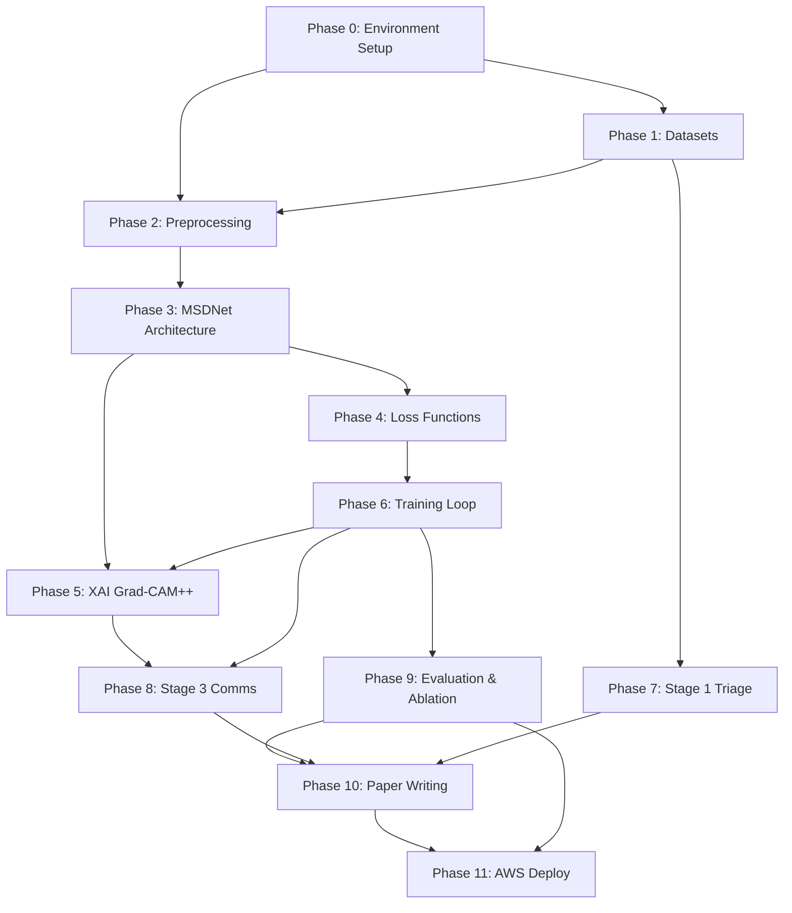

# IRDAS — Enhanced Execution Plan
## With Tracking, Logging, Recovery & Progress Management

> **IMPORTANT:** This document is your execution tracker.
> Update the status columns as you complete each step. Commit this file after every session.

---

## Master Progress Dashboard

| Phase | Description | Est. Hours | Status | Started | Completed | Blockers |
|-------|------------|-----------|--------|---------|-----------|----------|
| 0 | Environment Setup | 2h | `[ ]` | — | — | — |
| 1 | Dataset Acquisition & Validation | 4h | `[ ]` | — | — | HRDC requires manual registration |
| 2 | Preprocessing Pipeline | 3h | `[ ]` | — | — | — |
| 3 | MSDNet Architecture | 5h | `[ ]` | — | — | — |
| 4 | Loss Functions | 2h | `[ ]` | — | — | — |
| 5 | XAI (Grad-CAM++) | 2h | `[ ]` | — | — | — |
| 6 | Training Loop + Baseline | 8h | `[ ]` | — | — | GPU quota |
| 7 | Stage 1 — Triage Model | 3h | `[ ]` | — | — | NHANES data merge |
| 8 | Stage 3 — Multilingual Comms | 2h | `[ ]` | — | — | Gemini API key |
| 9 | Evaluation & Ablation | 10h | `[ ]` | — | — | 6 training runs |
| 10 | Paper Writing | 15h | `[ ]` | — | — | — |
| 11 | AWS Deployment | 5h | `[ ]` | — | — | Student pack credits |
| **Total** | | **~61h** | | | | |

**Status legend:** `[ ]` Not started · `[/]` In progress · `[x]` Done · `[!]` Blocked

---

## Phase Dependency Graph



**Key insight:** Phases 7 (Triage) and Phases 3-6 (MSDNet) can run **in parallel** since they're independent models. Do Phase 7 while waiting for GPU quota to reset.

---

## Logging Strategy

### 1. Experiment Tracking — WandB

```python
# === STANDARD WANDB INIT — use at top of every training notebook ===
import wandb, json
from datetime import datetime

def init_experiment(experiment_name, config, notes=""):
    """Call this at the start of every training run."""
    run = wandb.init(
        project="IRDAS",
        name=f"{experiment_name}_{datetime.now().strftime('%Y%m%d_%H%M')}",
        config=config,
        notes=notes,
        tags=[experiment_name, "v1"],
        save_code=True
    )
    log_entry = {
        "experiment": experiment_name,
        "started_at": datetime.now().isoformat(),
        "config": config,
        "wandb_run_id": run.id,
        "status": "running"
    }
    with open(f"logs/{experiment_name}_init.json", "w") as f:
        json.dump(log_entry, f, indent=2)
    return run
```

### 2. Local Session Logs (JSON)

```python
# === SAVE AT END OF EVERY KAGGLE SESSION ===
def save_session_log(session_name, metrics, notes=""):
    """Always run this before Kaggle session ends."""
    import json, os
    from datetime import datetime
    
    log = {
        "session": session_name,
        "timestamp": datetime.now().isoformat(),
        "metrics": metrics,
        "notes": notes,
        "gpu_hours_used": "CHECK_KAGGLE_DASHBOARD",
        "files_saved": [f for f in os.listdir("/kaggle/working/") 
                        if f.endswith(('.pth', '.csv', '.pkl'))],
    }
    os.makedirs("logs", exist_ok=True)
    path = f"logs/session_{datetime.now().strftime('%Y%m%d_%H%M')}.json"
    with open(path, "w") as f:
        json.dump(log, f, indent=2)
    print(f"Session log saved: {path}")
```

### 3. What to Log at Each Phase

| Phase | Log These | Where |
|-------|----------|-------|
| Data loading | Dataset sizes, class distributions, sample images | Notebook markdown cells |
| Preprocessing | Before/after images (10 samples), histogram stats | WandB images |
| Training | Loss curves (all 4 losses), LR schedule, grad norms | WandB metrics |
| Validation | QWK, AUC, confusion matrix per epoch | WandB + local CSV |
| Ablation | All 6 experiment rows with full metrics | `outputs/ablation_results.csv` |
| XAI | 10 sample heatmap pairs | WandB images + `outputs/xai_examples/` |

---

## Recovery Playbooks

### Recovery 1: Kaggle Session Crashed Mid-Training

```python
# 1. Check what was saved before crash
import os
checkpoints = sorted([f for f in os.listdir("/kaggle/working/checkpoints/") 
                       if f.endswith('.pth')])
print(f"Available checkpoints: {checkpoints}")

# 2. Resume from last checkpoint
def resume_training(model, optimizer, scheduler, checkpoint_path):
    checkpoint = torch.load(checkpoint_path)
    model.load_state_dict(checkpoint['model_state_dict'])
    optimizer.load_state_dict(checkpoint['optimizer_state_dict'])
    scheduler.load_state_dict(checkpoint['scheduler_state_dict'])
    start_epoch = checkpoint['epoch'] + 1
    best_qwk = checkpoint['best_qwk']
    print(f"Resumed from epoch {start_epoch}, best QWK: {best_qwk:.4f}")
    return start_epoch, best_qwk

# 3. Save checkpoints every 5 epochs, not just best
def save_checkpoint(model, optimizer, scheduler, epoch, metrics, best_qwk, path):
    torch.save({
        'epoch': epoch,
        'model_state_dict': model.state_dict(),
        'optimizer_state_dict': optimizer.state_dict(),
        'scheduler_state_dict': scheduler.state_dict(),
        'metrics': metrics,
        'best_qwk': best_qwk,
    }, path)
```

**Prevention:** Save checkpoint every 5 epochs + on best metric. Download `.pth` files before session ends.

### Recovery 2: GPU Quota Exhausted (30h/week limit)

**What to do during downtime (CPU-only tasks):**
1. Phase 7 (XGBoost triage — runs on CPU)
2. Data exploration notebooks
3. Paper writing / literature review
4. Code refactoring on local VS Code

**GPU Time Budget:**

| Task | Est. GPU Hours | Priority |
|------|---------------|----------|
| Baseline training (50 epochs) | 3-4h | HIGH |
| Full MSDNet training (50 epochs) | 5-6h | HIGH |
| Ablation exp 1-6 (6 × 50 epochs) | 18-24h | HIGH — spread over 4+ weeks |
| Vessel decoder pre-training | 1-2h | MEDIUM |
| MC Dropout inference (30 passes) | 0.5h | LOW |

### Recovery 3: Corrupt Checkpoint File

```python
def verify_checkpoint(path):
    try:
        ckpt = torch.load(path, map_location='cpu')
        print(f"Valid: epoch {ckpt.get('epoch', '?')}")
        return True
    except Exception as e:
        print(f"Corrupt: {e}")
        return False
```

### Recovery 4: Dataset Verification

```python
def verify_dataset(dataset_name, img_dir, csv_path, expected_min_count):
    import os, pandas as pd, cv2
    df = pd.read_csv(csv_path)
    img_count = len([f for f in os.listdir(img_dir) 
                     if f.endswith(('.png', '.jpg', '.jpeg'))])
    print(f"Dataset: {dataset_name} | CSV: {len(df)} | Images: {img_count} | Expected: {expected_min_count}")
    if img_count < expected_min_count:
        print(f"WARNING: Only {img_count}/{expected_min_count} images!")
        return False
    return True
```

---

## Risk Matrix

| Risk | Impact | Probability | Mitigation |
|------|--------|-------------|------------|
| HRDC dataset access denied | HIGH | Medium | Fallback: synthetic HR labels from vessel features |
| GPU quota runs out mid-ablation | MEDIUM | High | Schedule ablations across 4 weeks |
| QWK stays below 0.82 | HIGH | Low | Increase epochs, try mixup, check preprocessing |
| Contrastive loss NaN | MEDIUM | Medium | Start λ=0.1, increase gradually |
| Gemini API rate limit | LOW | Low | Cache responses, use offline templates |

---

## Phase-by-Phase Checklists

### Phase 0: Environment Setup `[ ]`
- [ ] Create repository structure
- [ ] Create `config/config.yaml`
- [ ] Create `requirements.txt` with pinned versions
- [ ] Create `.gitignore`
- [ ] Verify Kaggle GPU: `torch.cuda.get_device_name(0)` → "Tesla T4"
- [ ] Create WandB account + test `wandb.init()`
- [ ] Create `logs/` directory

### Phase 1: Dataset Acquisition `[ ]`
- [ ] Add APTOS 2019 → verify 3,662 train images
- [ ] Add IDRiD → verify ~516 images → **TEST ONLY**
- [ ] Register HRDC 2023 (grand-challenge.org) → **MANUAL**
- [ ] Upload HRDC to Kaggle as private dataset
- [ ] Add DRIVE → verify 40 images + 40 masks
- [ ] Download + merge NHANES data
- [ ] Run `verify_dataset()` on all datasets
- [ ] Log class distributions for APTOS

### Phase 2: Preprocessing `[ ]`
- [ ] Implement `clahe_preprocess.py`
- [ ] Implement `augmentation_pipeline.py`
- [ ] Visual verify on 10 images per dataset
- [ ] Compare before/after histograms
- [ ] Save samples to `outputs/preprocessing_samples/`

### Phase 3: MSDNet Architecture `[ ]`
- [ ] `backbone.py` — EfficientNet-B0
- [ ] `fpn.py` — Feature Pyramid Network
- [ ] `cbam.py` — Attention module
- [ ] `disease_branches.py` — DR + HR heads
- [ ] `vessel_decoder.py` — U-Net decoder
- [ ] `msdnet.py` — Full assembly
- [ ] Smoke test with random `(2, 3, 224, 224)` tensor
- [ ] Count params: expect ~6-8M

### Phase 4: Loss Functions `[ ]`
- [ ] `disentangle_loss.py` — Novel contrastive loss
- [ ] `task_loss.py` — Focal loss
- [ ] `vessel_loss.py` — Dice + BCE
- [ ] Unit test all losses with synthetic data
- [ ] Verify no NaN outputs

### Phase 5: XAI `[ ]`
- [ ] Implement `gradcam_branches.py`
- [ ] Test on 5 images after training
- [ ] Verify DR/HR heatmaps differ
- [ ] Implement `describe_heatmap_regions()`

### Phase 6: Training `[ ]`
- [ ] Implement `train.py` with checkpoint saving every 5 epochs
- [ ] **Baseline run:** QWK > 0.82
- [ ] **Full MSDNet run:** QWK > 0.89, HR AUC > 0.91
- [ ] Monitor all 4 loss curves
- [ ] Check for overfitting after epoch 30

### Phase 7: Triage (parallel with 3-6) `[ ]`
- [ ] Implement `triage_model.py`
- [ ] Merge NHANES files
- [ ] 5-fold CV → AUC > 0.79
- [ ] SHAP summary plot

### Phase 8: Multilingual Comms `[ ]`
- [ ] Get Gemini API key
- [ ] Implement `multilingual_report.py`
- [ ] Generate 3 sample reports (Hindi/Tamil/Telugu)

### Phase 9: Evaluation & Ablation `[ ]`
- [ ] Implement `metrics.py`
- [ ] Run all 6 ablation experiments
- [ ] Cross-dataset test on IDRiD → QWK > 0.72
- [ ] MC Dropout uncertainty analysis
- [ ] Generate `ablation_results.csv`

### Phase 10: Paper `[ ]`
- [ ] Method section + architecture figure
- [ ] Results (Tables 1-3, Figures 1-4)
- [ ] Introduction + Related Work
- [ ] Discussion + Limitations
- [ ] Abstract (write last)

### Phase 11: AWS Deploy `[ ]`
- [ ] See `IRDAS_PROJECT_COMPLETION_GUIDE.md`

---

## Metric Targets Quick Reference

| Metric | Dataset | Target | Stop & Debug If |
|--------|---------|--------|-----------------|
| DR QWK (baseline) | APTOS val | > 0.82 | < 0.70 after 30 epochs |
| DR QWK (MSDNet) | APTOS val | > 0.89 | < 0.80 after 30 epochs |
| HR AUC | HRDC val | > 0.91 | < 0.75 after 30 epochs |
| Vessel Dice | DRIVE test | > 0.76 | < 0.60 after 20 epochs |
| ECE | APTOS test | < 0.06 | > 0.15 |
| DR QWK (generalize) | IDRiD test | > 0.72 | < 0.55 |
| Triage AUC | NHANES 5-fold | > 0.79 | < 0.65 |

---

## Version Control Strategy

### Commit Convention
```
[PHASE-X] Brief description
Examples:
[PHASE-0] Initialize project structure and config.yaml
[PHASE-3] Add EfficientNet-B0 backbone with FPN hooks
[PHASE-6] Baseline training complete — QWK 0.837
```

### .gitignore
```
data/raw/
*.png
*.jpg
checkpoints/*.pth
*.pkl
wandb/
logs/*.json
__pycache__/
*.pyc
.env
```

---

## Suggested 8-Week Schedule

| Week | Mon-Tue | Wed-Thu | Fri-Sat | GPU Budget |
|------|---------|---------|---------|------------|
| 1 | Phase 0 + 1 | Phase 2 | Phase 3 start | 2h |
| 2 | Phase 3 finish | Phase 4 | Phase 6 baseline | 6h |
| 3 | Phase 7 (CPU) | Phase 6 full MSDNet | Review + debug | 8h |
| 4 | Ablation 1-2 | Ablation 3 | Phase 5 XAI | 10h |
| 5 | Ablation 4-5 | Ablation 6 | Phase 8 comms | 10h |
| 6 | Phase 9 eval | Cross-dataset | Calibration | 4h |
| 7 | Paper: Method | Paper: Intro | Paper: Polish | 0h |
| 8 | AWS deploy | Paper submit | Buffer | 2h |

---

*Enhanced Plan v1.0 — Updated: 2026-05-16*
